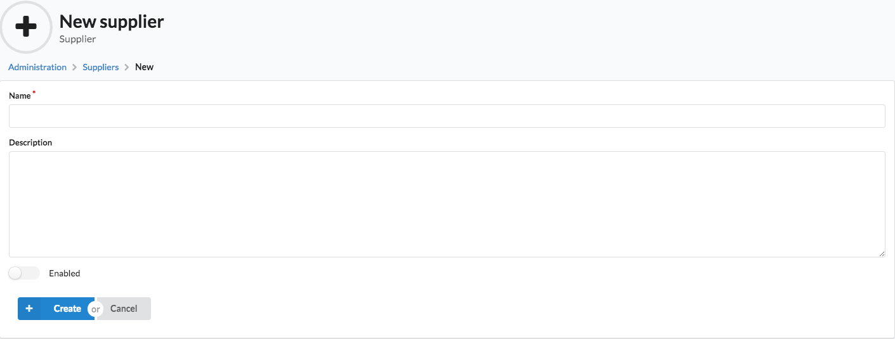
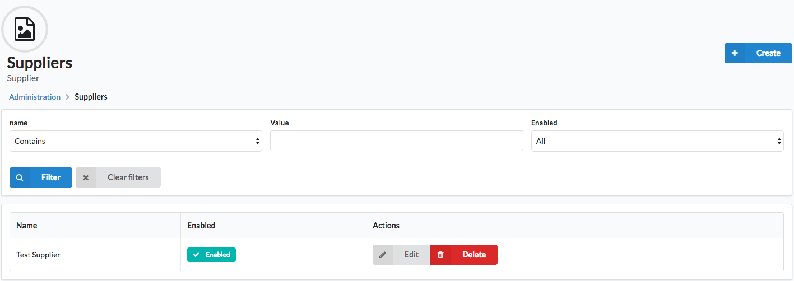

Your First Grid
===============

In order to use grids, we need to register your entity as a Sylius
resource. Let us assume you have a Supplier model in your application,
which represents a supplier of goods in your shop and has several
fields, including name, description and enabled field.

In order to make it a Sylius resource, you need to configure it under
`sylius_resource` node. If you don’t have it yet, create a file
`config/packages/sylius_resource.yaml`.

```yaml
# config/packages/sylius_resource.yaml
sylius_resource:
    resources:
        app.supplier:
            driver: doctrine/orm
            classes:
                model: App\Entity\Supplier
```

That's it! Your class is now a resource. In order to learn what does it
mean, please refer to the 
[SyliusResourceBundle](https://github.com/Sylius/SyliusResourceBundle/blob/master/docs/index.md)
documentation.

Grid Maker
----------

You can create your grid using the Symfony Maker bundle.

```shell
$ bin/console make:grid
```

Grid Definition
---------------

Now we can configure our first grid:

 ### **Note**
 
Remember that a grid is *the way objects of a desired entity are
displayed on its index view*. Therefore only fields that are useful
for identification of objects are available - only `string` and `twig`
type. Then even though a Supplier has also a description field, it is
not needed on index and can't be displayed here.

<details open><summary>Yaml</summary>

```yaml
# config/packages/sylius_grid.yaml
sylius_grid:
    grids:
        app_admin_supplier:
            driver:
                name: doctrine/orm
                options:
                    class: App\Entity\Supplier
            fields:
                name:
                    type: string
                    label: sylius.ui.name
                enabled:
                    type: twig
                    label: sylius.ui.enabled
                    options:
                        template: "@SyliusUi/Grid/Field/enabled.html.twig" # This will be a checkbox field
```

</details>

<details open><summary>PHP</summary>

```php
<?php

use App\Entity\Suplier;
use Sylius\Bundle\GridBundle\Builder\GridBuilder;
use Sylius\Bundle\GridBundle\Builder\Field\StringField;
use Sylius\Bundle\GridBundle\Builder\Field\TwigField;
use Sylius\Bundle\GridBundle\Config\GridConfig;

return static function (GridConfig $grid) {
    $grid->addGrid(GridBuilder::create('app_admin_supplier', Suplier::class)
        ->addField(
            StringField::create('name')
                ->setLabel('sylius.ui.name')
        )
        ->addField(
            TwigField::create('enabled', 'SyliusUiBundle:Grid/Field:enabled.html.twig')
                ->setLabel('sylius.ui.enabled')
        )
    )
};
```

OR

```php
<?php
# src/Grid/AdminSupplierGrid.php

declare(strict_types=1);

namespace App\Grid;

use App\Entity\Suplier;
use Sylius\Bundle\GridBundle\Builder\Field\StringField;
use Sylius\Bundle\GridBundle\Builder\Field\TwigField;
use Sylius\Bundle\GridBundle\Builder\GridBuilderInterface;
use Sylius\Bundle\GridBundle\Grid\AbstractGrid;
use Sylius\Bundle\GridBundle\Grid\ResourceAwareGridInterface;

final class AdminSupplierGrid extends AbstractGrid implements ResourceAwareGridInterface
{
    public static function getName(): string
    {
           return 'app_admin_supplier';
    }

    public function buildGrid(GridBuilderInterface $gridBuilder): void
    {
        $gridBuilder
            ->addField(
                StringField::create('name')
                    ->setLabel('sylius.ui.name')
            )
            ->addField(
                TwigField::create('enabled', 'SyliusUiBundle:Grid/Field:enabled.html.twig')
                    ->setLabel('sylius.ui.enabled')
            )
        ;    
    }
    
    public function getResourceClass(): string
    {
        return Suplier::class;
    }
}
```

</details>

Generating The CRUD Routing
---------------------------

That's it. SyliusResourceBundle allows to generate a default CRUD
interface including the grid we have just defined. Just put this in your
routing configuration!

```yaml
# config/routes.yaml
app_admin_supplier:
    resource: |
        alias: app.supplier
        section: admin
        templates: "@SyliusAdmin\\Crud"
        except: ['show']
        redirect: update
        grid: app_admin_supplier
        vars:
            all:
                subheader: app.ui.supplier # define a translation key for your entity subheader
            index:
                icon: 'file image outline' # choose an icon that will be displayed next to the subheader
    type: sylius.resource
    prefix: admin
```

This will generate the following paths:

> -   `/admin/suppliers/` - [`GET`] - Your grid.
> -   `/admin/suppliers/new` - [`GET/POST`] - Creating new supplier.
> -   `/admin/suppliers/{id}/edit` - [`GET/PUT`] - Editing an existing supplier.
> -   `/admin/suppliers/{id}` - [`DELETE`] - Deleting specific supplier.
> -   `/admin/suppliers/{id}` - [`GET`] - Displaying specific supplier.

### *Tip*

[In the Semantic UI documentation](http://semantic-ui.com/elements/icon.html) 
you can find all possible icons you can choose for your grid.

### *Tip*

See how to add links to your new entity administration in the
 [administration menu](https://docs.sylius.com/en/latest/customization/menu.html).

### *Tip*

Adding translations to the grid (read more
[here](https://docs.sylius.com/en/latest/customization/translation.html)):


```yaml
# translations/messages.en.yaml
app:
    ui:
        supplier: Supplier
        suppliers: Suppliers
    menu:
        admin:
            main:
                additional:
                    header: Additional
                    suppliers: Suppliers
```

After that your new grid should look like that when accessing the
`/admin/suppliers/new` path in order to create new object:



And when accessing index on the */admin/suppliers/* path it should look
like that:


Defining Filters
----------------

In order to make searching for certain things in your grid you can use
filters.

<details open><summary>Yaml</summary>

```yaml
sylius_grid:
    grids:
        app_admin_supplier:
            # ...
            filters:
                name:
                    type: string
                enabled:
                    type: boolean
```

</details>

<details open><summary>PHP</summary>

```php
<?php

use App\Entity\Suplier;
use Sylius\Bundle\GridBundle\Builder\GridBuilder;
use Sylius\Bundle\GridBundle\Builder\Filter\BooleanFilter;
use Sylius\Bundle\GridBundle\Builder\Filter\StringFilter;
use Sylius\Bundle\GridBundle\Config\GridConfig;

return static function (GridConfig $grid) {
    $grid->addGrid(GridBuilder::create('app_admin_supplier', Suplier::class)
        ->addFilter(
            StringFilter::create('name')
        )
        ->addFilter(
            BooleanFilter::create('enabled')
        )
    )
};
```

OR

```php
<?php
# src/Grid/AdminSupplierGrid.php

declare(strict_types=1);

namespace App\Grid;

use App\Entity\Suplier;
use Sylius\Bundle\GridBundle\Builder\Filter\BooleanFilter;
use Sylius\Bundle\GridBundle\Builder\Filter\StringFilter;
use Sylius\Bundle\GridBundle\Builder\GridBuilderInterface;
use Sylius\Bundle\GridBundle\Grid\AbstractGrid;
use Sylius\Bundle\GridBundle\Grid\ResourceAwareGridInterface;

final class AdminSupplierGrid extends AbstractGrid implements ResourceAwareGridInterface
{
    public static function getName(): string
    {
           return 'app_admin_supplier';
    }

    public function buildGrid(GridBuilderInterface $gridBuilder): void
    {
        $gridBuilder
            ->addFilter(
                StringFilter::create('name')
            )
            ->addFilter(
                BooleanFilter::create('enabled')
            )
        ;    
    }
    
    public function getResourceClass(): string
    {
        return Suplier::class;
    }
}
```

</details>

How will it look like in the admin panel?


What about filtering by fields of related entities? For instance if you
would like to filter your suppliers by their country of origin, which is
a property of the associated address entity.

This first requires a
custom [repository method](https://docs.sylius.com/en/latest/customization/repository.html) for your grid
query:

<details open><summary>Yaml</summary>

```yaml
# config/packages/sylius_grid.yaml
sylius_grid:
    grids:
        app_admin_supplier:
            driver:
                name: doctrine/orm
                options:
                    class: App\Entity\Supplier
                    repository:
                        method: mySupplierGridQuery
```

</details>

<details open><summary>PHP</summary>

```php
<?php
// config/packages/sylius_grid.php

use App\Entity\Suplier;
use Sylius\Bundle\GridBundle\Builder\GridBuilder;
use Sylius\Bundle\GridBundle\Builder\Filter\BooleanFilter;
use Sylius\Bundle\GridBundle\Builder\Filter\StringFilter;
use Sylius\Bundle\GridBundle\Config\GridConfig;

return static function (GridConfig $grid) {
    $grid->addGrid(GridBuilder::create('app_admin_supplier', Suplier::class)
        ->setRepositoryMethod('mySupplierGridQuery')
    )
};
```

OR

```php
<?php
# src/Grid/AdminSupplierGrid.php

declare(strict_types=1);

namespace App\Grid;

use App\Entity\Suplier;
use Sylius\Bundle\GridBundle\Builder\Filter\BooleanFilter;
use Sylius\Bundle\GridBundle\Builder\Filter\StringFilter;
use Sylius\Bundle\GridBundle\Builder\GridBuilderInterface;
use Sylius\Bundle\GridBundle\Grid\AbstractGrid;
use Sylius\Bundle\GridBundle\Grid\ResourceAwareGridInterface;

final class AdminSupplierGrid extends AbstractGrid implements ResourceAwareGridInterface
{
    public static function getName(): string
    {
           return 'app_admin_supplier';
    }

    public function buildGrid(GridBuilderInterface $gridBuilder): void
    {
        $gridBuilder
            ->setRepositoryMethod('mySupplierGridQuery')
        ;    
    }
    
    public function getResourceClass(): string
    {
        return Suplier::class;
    }
}
```

</details>

### *Note*

The repository method has to return a queryBuilder object, since the
query has to adjustable depending on the filters and sorting the user
later applies.

  Furthermore, all sub entities you wish to use later for filtering
have to be joined explicitly in the query.

Then you can set up your filter to accordingly:

<details open><summary>Yaml</summary>

```yaml
sylius_grid:
    grids:
        app_admin_supplier:
            # ...
            filters:
                # ...
                country:
                    type: string
                    label: origin
                    options:
                        fields: [address.country]
                    form_options:
                        type: contains
```

</details>

<details open><summary>PHP</summary>

```php
<?php
// config/packages/sylius_grid.php

use App\Entity\Suplier;
use Sylius\Bundle\GridBundle\Builder\GridBuilder;
use Sylius\Bundle\GridBundle\Builder\Filter\StringFilter;
use Sylius\Bundle\GridBundle\Config\GridConfig;

return static function (GridConfig $grid) {
    $grid->addGrid(GridBuilder::create('app_admin_supplier', Suplier::class)
        ->addFilter(
            StringFilter::create('country', ['address.country'], 'contains')
                ->setLabel('origin')
        )
    )
};
```

OR

```php
<?php
# src/Grid/AdminSupplierGrid.php

declare(strict_types=1);

namespace App\Grid;

use App\Entity\Suplier;
use Sylius\Bundle\GridBundle\Builder\Filter\StringFilter;
use Sylius\Bundle\GridBundle\Builder\GridBuilderInterface;
use Sylius\Bundle\GridBundle\Grid\AbstractGrid;
use Sylius\Bundle\GridBundle\Grid\ResourceAwareGridInterface;

final class AdminSupplierGrid extends AbstractGrid implements ResourceAwareGridInterface
{
    public static function getName(): string
    {
           return 'app_admin_supplier';
    }

    public function buildGrid(GridBuilderInterface $gridBuilder): void
    {
        $gridBuilder
            ->addFilter(
                StringFilter::create('country', ['address.country'], 'contains')
                    ->setLabel('origin')
            )
        ;    
    }
    
    public function getResourceClass(): string
    {
        return Suplier::class;
    }
}
```

</details>

Default Sorting
---------------

You can define by which field you want the grid to be sorted and how.

<details open><summary>Yaml</summary>

```yaml
# config/packages/sylius_grid.yaml
sylius_grid:
    grids:
        app_admin_supplier:
            # ...
            sorting:
                name: asc
                # ...
```

</details>

<details open><summary>PHP</summary>

```php
<?php
// config/packages/sylius_grid.php

use App\Entity\Suplier;
use Sylius\Bundle\GridBundle\Builder\GridBuilder;
use Sylius\Bundle\GridBundle\Config\GridConfig;

return static function (GridConfig $grid) {
    $grid->addGrid(GridBuilder::create('app_admin_supplier', Suplier::class)
        ->orderBy('name', 'asc')
    )
};
```

OR

```php
<?php
# src/Grid/AdminSupplierGrid.php

declare(strict_types=1);

namespace App\Grid;

use App\Entity\Suplier;
use Sylius\Bundle\GridBundle\Builder\GridBuilderInterface;
use Sylius\Bundle\GridBundle\Grid\AbstractGrid;
use Sylius\Bundle\GridBundle\Grid\ResourceAwareGridInterface;

final class AdminSupplierGrid extends AbstractGrid implements ResourceAwareGridInterface
{
    public static function getName(): string
    {
           return 'app_admin_supplier';
    }

    public function buildGrid(GridBuilderInterface $gridBuilder): void
    {
        $gridBuilder
            ->orderBy('name', 'asc')
        ;    
    }
    
    public function getResourceClass(): string
    {
        return Suplier::class;
    }
}
```

</details>

Then at the fields level, define that the field can be used for sorting:

<details open><summary>Yaml</summary>

```yaml
# config/packages/sylius_grid.yaml
sylius_grid:
    grids:
        app_admin_supplier:
            # ...
            fields:
                name:
                    type: string
                    label: sylius.ui.name
                    sortable: ~
                # ...
```

</details>

<details open><summary>PHP</summary>

```php
<?php
// config/packages/sylius_grid.php

use App\Entity\Suplier;
use Sylius\Bundle\GridBundle\Builder\Field\StringField;
use Sylius\Bundle\GridBundle\Builder\GridBuilder;
use Sylius\Bundle\GridBundle\Config\GridConfig;

return static function (GridConfig $grid) {
    $grid->addGrid(GridBuilder::create('app_admin_supplier', Suplier::class)
        ->addField(
            StringField::create('name')
                ->setLabel('sylius.ui.name')
                ->setSortable(true)
        )
    )
};
```

OR

```php
<?php
# src/Grid/AdminSupplierGrid.php

declare(strict_types=1);

namespace App\Grid;

use App\Entity\Suplier;
use Sylius\Bundle\GridBundle\Builder\Field\StringField;
use Sylius\Bundle\GridBundle\Builder\GridBuilderInterface;
use Sylius\Bundle\GridBundle\Grid\AbstractGrid;
use Sylius\Bundle\GridBundle\Grid\ResourceAwareGridInterface;

final class AdminSupplierGrid extends AbstractGrid implements ResourceAwareGridInterface
{
    public static function getName(): string
    {
           return 'app_admin_supplier';
    }

    public function buildGrid(GridBuilderInterface $gridBuilder): void
    {
        $gridBuilder
            ->addField(
                StringField::create('name')
                    ->setLabel('sylius.ui.name')
                    ->setSortable(true)
            )
        ;    
    }
    
    public function getResourceClass(): string
    {
        return Suplier::class;
    }
}
```

</details>

If your field is not of a "simple" type, f.i. a twig template with a
specific path, you get sorting working with the following definition:

<details open><summary>YAML</summary>

```yaml
# config/packages/sylius_grid.yaml
sylius_grid:
    grids:
        app_admin_supplier:
            # ...
            fields:
                # ...
                origin:
                    type: twig
                    options:
                        template: "@App/Grid/Fields/myCountryFlags.html.twig"
                    path: address.country
                    label: app.ui.country
                    sortable: address.country
                # ...
```

</details>

<details open><summary>PHP</summary>

```php
<?php
// config/packages/sylius_grid.php

use App\Entity\Suplier;
use Sylius\Bundle\GridBundle\Builder\Field\TwigField;
use Sylius\Bundle\GridBundle\Builder\GridBuilder;
use Sylius\Bundle\GridBundle\Config\GridConfig;

return static function (GridConfig $grid) {
    $grid->addGrid(GridBuilder::create('app_admin_supplier', Suplier::class)
        ->addField(
            TwigField::create('name', '@App/Grid/Fields/myCountryFlags.html.twig')
                ->setPath('address.country')
                ->setLabel('app.ui.country')
                ->setSortable(true, 'address.country')
        )
    )
};
```

OR

```php
<?php
# src/Grid/AdminSupplierGrid.php

declare(strict_types=1);

namespace App\Grid;

use App\Entity\Suplier;
use Sylius\Bundle\GridBundle\Builder\Field\TwigField;
use Sylius\Bundle\GridBundle\Builder\GridBuilderInterface;
use Sylius\Bundle\GridBundle\Grid\AbstractGrid;
use Sylius\Bundle\GridBundle\Grid\ResourceAwareGridInterface;

final class AdminSupplierGrid extends AbstractGrid implements ResourceAwareGridInterface
{
    public static function getName(): string
    {
           return 'app_admin_supplier';
    }

    public function buildGrid(GridBuilderInterface $gridBuilder): void
    {
        $gridBuilder
            ->addField(
                TwigField::create('name', '@App/Grid/Fields/myCountryFlags.html.twig')
                    ->setPath('address.country')
                    ->setLabel('app.ui.country')
                    ->setSortable(true, 'address.country')
            )
        ;    
    }
    
    public function getResourceClass(): string
    {
        return Suplier::class;
    }
}
```

</details>

Pagination
----------

You can limit how many items are visible on each page by providing an
array of integers into the `limits` parameter. The first element of the
array will be treated as the default, so by configuring:

<details open><summary>YAML</summary>

```yaml
# config/packages/sylius_grid.yaml
sylius_grid:
    grids:
        app_admin_supplier:
            # ...
            limits: [30, 12, 48]
                # ...
```

</details>

<details open><summary>PHP</summary>

```php
<?php
// config/packages/sylius_grid.php

use App\Entity\Suplier;
use Sylius\Bundle\GridBundle\Builder\GridBuilder;
use Sylius\Bundle\GridBundle\Config\GridConfig;

return static function (GridConfig $grid) {
    $grid->addGrid(GridBuilder::create('app_admin_supplier', Suplier::class)
        ->setLimits([30, 12, 48])
    )
};
```

OR

```php
<?php
# src/Grid/AdminSupplierGrid.php

declare(strict_types=1);

namespace App\Grid;

use App\Entity\Suplier;
use Sylius\Bundle\GridBundle\Builder\Field\TwigField;
use Sylius\Bundle\GridBundle\Builder\GridBuilderInterface;
use Sylius\Bundle\GridBundle\Grid\AbstractGrid;
use Sylius\Bundle\GridBundle\Grid\ResourceAwareGridInterface;

final class AdminSupplierGrid extends AbstractGrid implements ResourceAwareGridInterface
{
    public static function getName(): string
    {
           return 'app_admin_supplier';
    }

    public function buildGrid(GridBuilderInterface $gridBuilder): void
    {
        $gridBuilder
            ->setLimits([30, 12, 48])
        ;    
    }
    
    public function getResourceClass(): string
    {
        return Suplier::class;
    }
}
```

</details>

you will see thirty suppliers per page, also you will have the
possibility to change the number of elements to either 12 or 48.

### *Note*

Pagination limits are set by default to 10, 25 and 50 items per page.
In order to turn it off, configure limits: \~.

Actions Configuration
---------------------

Next step is adding some actions to the grid: create, update and delete.

### *Note*

There are two types of actions that can be added to a grid: `main`
which "influence" the whole grid (like adding new objects) and `item`
which influence one row of the grid (one object) like editing or
deleting.

<details open><summary>YAML</summary>

```yaml
# config/packages/sylius_grid.yaml
sylius_grid:
    grids:
        app_admin_supplier:
            # ...
            actions:
                main:
                    create:
                        type: create
                item:
                    update:
                        type: update
                    delete:
                        type: delete
```

</details>

<details open><summary>PHP</summary>

```php
<?php
// config/packages/sylius_grid.php

use App\Entity\Suplier;
use Sylius\Bundle\GridBundle\Builder\Action\CreateAction;
use Sylius\Bundle\GridBundle\Builder\Action\DeleteAction;
use Sylius\Bundle\GridBundle\Builder\Action\UpdateAction;
use Sylius\Bundle\GridBundle\Builder\ActionGroup\ItemActionGroup;
use Sylius\Bundle\GridBundle\Builder\ActionGroup\MainActionGroup;
use Sylius\Bundle\GridBundle\Builder\GridBuilder;
use Sylius\Bundle\GridBundle\Config\GridConfig;

return static function (GridConfig $grid) {
    $grid->addGrid(GridBuilder::create('app_admin_supplier', Suplier::class)
        ->addActionGroup(
            MainActionGroup::create(
                CreateAction::create()
            )
        )
        ->addActionGroup(
            ItemActionGroup::create(
                UpdateAction::create(),
                DeleteAction::create()
            )
        )
    )
};
```

OR

```php
<?php
# src/Grid/AdminSupplierGrid.php

declare(strict_types=1);

namespace App\Grid;

use App\Entity\Suplier;
use Sylius\Bundle\GridBundle\Builder\Action\CreateAction;
use Sylius\Bundle\GridBundle\Builder\Action\DeleteAction;
use Sylius\Bundle\GridBundle\Builder\Action\UpdateAction;
use Sylius\Bundle\GridBundle\Builder\ActionGroup\ItemActionGroup;
use Sylius\Bundle\GridBundle\Builder\ActionGroup\MainActionGroup;
use Sylius\Bundle\GridBundle\Builder\GridBuilderInterface;
use Sylius\Bundle\GridBundle\Grid\AbstractGrid;
use Sylius\Bundle\GridBundle\Grid\ResourceAwareGridInterface;

final class AdminSupplierGrid extends AbstractGrid implements ResourceAwareGridInterface
{
    public static function getName(): string
    {
           return 'app_admin_supplier';
    }

    public function buildGrid(GridBuilderInterface $gridBuilder): void
    {
        $gridBuilder
            ->addActionGroup(
                MainActionGroup::create(
                    CreateAction::create()
                )
            )
            ->addActionGroup(
                ItemActionGroup::create(
                    UpdateAction::create(),
                    DeleteAction::create()
                )
            )
        ;    
    }
    
    public function getResourceClass(): string
    {
        return Suplier::class;
    }
}
```

</details>

This activates such a view on the `/admin/suppliers/` path:



Your grid is ready to use!
